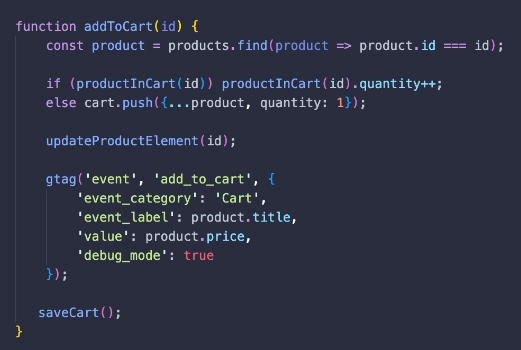
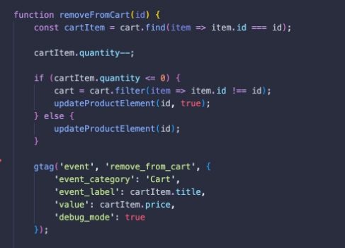
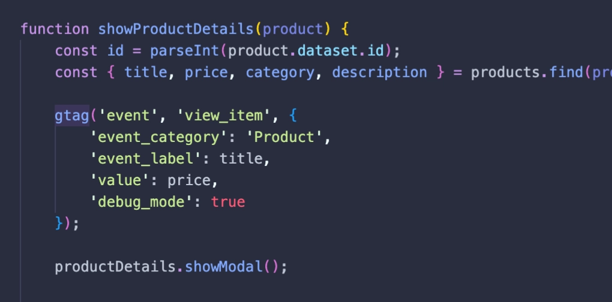
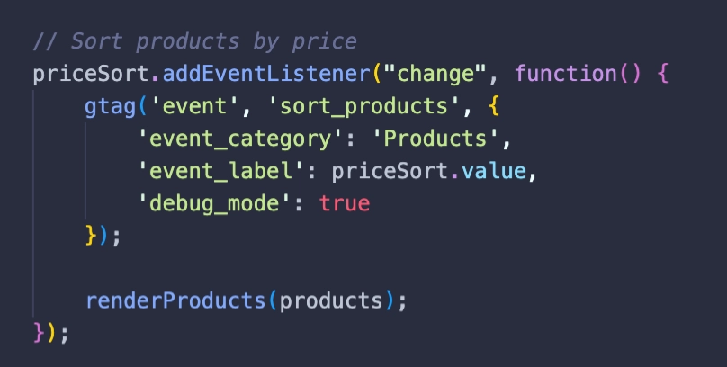

# js-webshop

Detta är en enkel mockup av ett webbshop interface gjort med JavaScript. Produkter hämtas in via API:et https://fakestoreapi.com/ och kan visas utifrån kategori och sortera efter pris. Klickar man på produkten får man upp en ruta där man kan läsa en produktbeskrivning. Produkterna kan läggas till i och tas bort ur en varukorg, och i varukorgen kan man se den totala summan för alla produkter som ligger i varukorgen. Den sparas även via local storage, så om man navigerar iväg från sidan eller stänger webbläsaren så kommer sidan komma ihåg vad man lagt i varukorgen. Jag har valt att visa emojis istället för att ladda in bilder från API:n för att spara laddningstid och inte slösa onödig bandbredd.

Sidan är funktionell, men kan förbättras på många sätt. En checkout-vy hade med fördel kunnat läggas till för att ge en mer komplett illustration av en riktigt webbshop, och små förbättringar som att kunna ändra produktantal i detaljvyn och i varukorgen, klicka utanför detaljvyn för att smidigt kunna stänga den, etc. En mer väldesignat mobil-vy hade också varit bra då vissa element inte är helt optimerade för det och nog ser like konstiga ut eller inte så snygga som de hade kunnat vara vid lägre skärmstorlek. Andra förbättringar skulle även kunna vara att visa en text eller en laddningsanimation medan produktdatan läses in för att ge besökaren bättre information om vad som händer, och ev. kunna hantera pagination eller infinite scrolling ifall man skulle ha ett större antal produkter att visa.

## Google analytics & gtag.js

Webbshoppen [finns live via Netlify](https://idaoh-js-webshop.netlify.app) och är kopplad genom gtag.js till Google analytics. Jag har skapat några custom events för att mer detaljerat se vad besökare klickar på.

Min första custom event spårar när produkter läggs in i varukorgen. Denna information ger statistik över vilka artiklar som mer ofta än andra hamnar i varukorgen:

Nästa event gäller när en artikel tas bort ur varukorgen. Genom att följa detta event kan man se att en kund är intresserad av en produkt, men av någon anledning valt att inte gå vidare till nästa steg:

Jag har även ett event som spåras när en besökare klickar för att läsa mer om produkten. Detta kan tyda på intresse, men att det är någonting som saknas för att övertyga besökaren att lägga det i varukorgen:

Jag lade också in ett event när en besökare filtrerar produkterna efter pris. Detta kan vara intressant att veta hur besökaren relaterar till pris när denne letar efter produkter att köpa:

## Reflektion om händelsespårning

Reflektera i teamet och sammanfatta på 300-500 ord i Readme.md. Vilka möjligheter finns det med händelsespårning? Finns det begränsningar?

Händelsespårning är en mycket värdefull källa för insamling av statistik och information som kan användas på många olika sätt. Framförallt har det en viktigt inom marknadsföring och försäljning där ju mer information man kan få ut från potentiella kunder desto bättre. Händelsespårning på en hemsida som säljer produkter eller tjänster är ett verktyg som kan hjälpa en att hitta brister i sina produkter och hur produkter presenteras, och på så vis använda den statistiken för att förbättra sin försäljning. Om produkter ofta läggs i varukorgen men sällan går vidare till ett faktiskt köp kan man där se att intresse finns, men att kanske priset priset är för högt eller liknande.

Genom att identifiera olika typer av användare kan man mer effektivt visa relevant innehåll och produkter som har större chans att vara av intresse för användaren, och ger också en bättre bild av vilket användargrupp som är mest gynnsam att fokusera på.

Händelsespårning kan även användas för att förbättra användarupplevelsen och upptäcka tekniska brister på en hemsida. Vid implementering av nya funktioner kan man följa användarnas beteendemöster för att se om uppdateringen har haft en positiv eller negativ påverkan på hur användarna interagerar med hemsidan.

Data är inte alltid bättre i större mängder, och kan bli svårtolkat om man inte har en bra strategi och förståelse för hur statistiken bör utläsas. Har man inte heller tekniskt satt upp sin händelsespårning på ett bra och korrekt vis kan det bidra till felaktik data. Även om man kan få en bra bild över vad en användare faktiskt gör, så kan man inte utläsa motiveringen bakom varför de gjort som de gjort, vilket det också är mycket viktigt data man inte får glömma bort och kan behöva införskaffas på alternativa sätt till händelsespårning. Vid för detaljerad händelsespårning blir även saker så som integritet och etik stora frågor som bör tas i beaktning, speciellt med tanke på lagar och regler som GDPR vilka måste efterföljas.